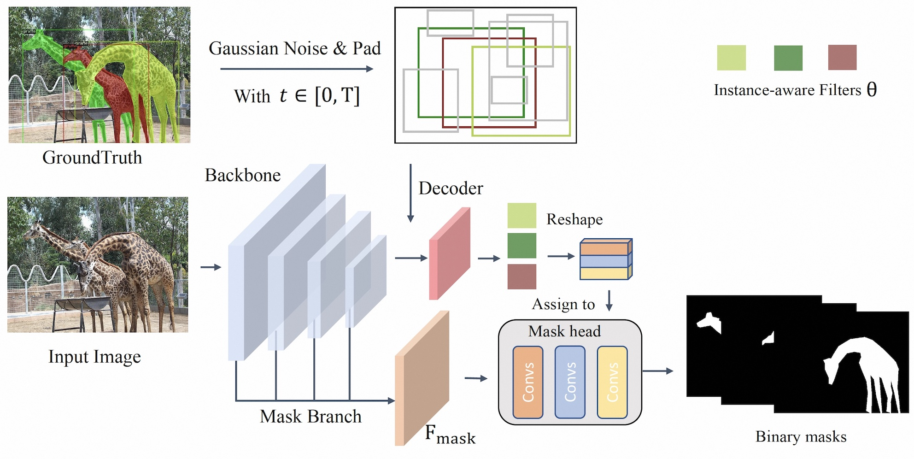
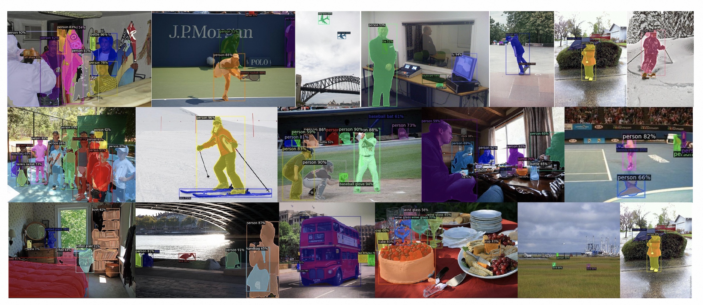

## DiffusionInst: Diffusion Model for Instance Segmentation

**If you have any questions, please move to [https://github.com/chenhaoxing/DiffusionInst](https://github.com/chenhaoxing/DiffusionInst).**

**DiffusionInst is the first work of diffusion model for instance segmentation.**


> [**DiffusionInst: Diffusion Model for Instance Segmentation**](https://arxiv.org/abs/2212.xxxx)               
> [Zhangxuan Gu](https://scholar.google.com/citations?user=Wkp3s68AAAAJ&hl=zh-CN&oi=ao), [Haoxing Chen](https://chenhaoxing.github.io/), Zhuoer Xu, Jun Lan, Changhua Meng, [Weiqiang Wang*](https://scholar.google.com/citations?hl=zh-CN&user=yZ5iffAAAAAJ) 
> *[arXiv 2212.xxxx](https://arxiv.org/abs/2212.xxxxx)*  

## Getting Started
The installation instruction and usage are in [Getting Started with DiffusionInst](GETTING_STARTED.md).

## Model Performance
Method | Mask AP (1 step) | Mask AP (4 step) 
--- |:---:|:---:
COCO-Res50 | 35.1| 35.5 
COCO-Res101 | 36.3| 36.5 
COCO-Swin-B| 44.0| 44.2
LVIS-Res50 | 22.3| - 
LVIS-Res101| 24.6| - 
LVIS-Swin-B| 34.8| - 



## Citing DiffusionInst

If you use DiffusionInst in your research or wish to refer to the baseline results published here, please use the following BibTeX entry.

```BibTeX
@article{DiffusionInst,
      title={DiffusionInst: Diffusion Model for Instance Segmentation},
      author={Gu, Zhangxuan and Chen, Haoxing and Xu, Zhuoer and Lan, Jun and Meng, Changhua and Wang, Weiqiang},
      journal={arXiv preprint arXiv:2212.xxxxx},
      year={2022}
}
```
## Acknowledgement
Our pretraining codes and configs follow [DiffusionDet](https://github.com/ShoufaChen/DiffusionDet).

## Contacts
Please feel free to contact us if you have any problems.

Email: [haoxingchen@smail.nju.edu.cn](haoxingchen@smail.nju.edu.cn) or [guzhangxuan.gzx@antgroup.com](guzhangxuan.gzx@antgroup.com)


